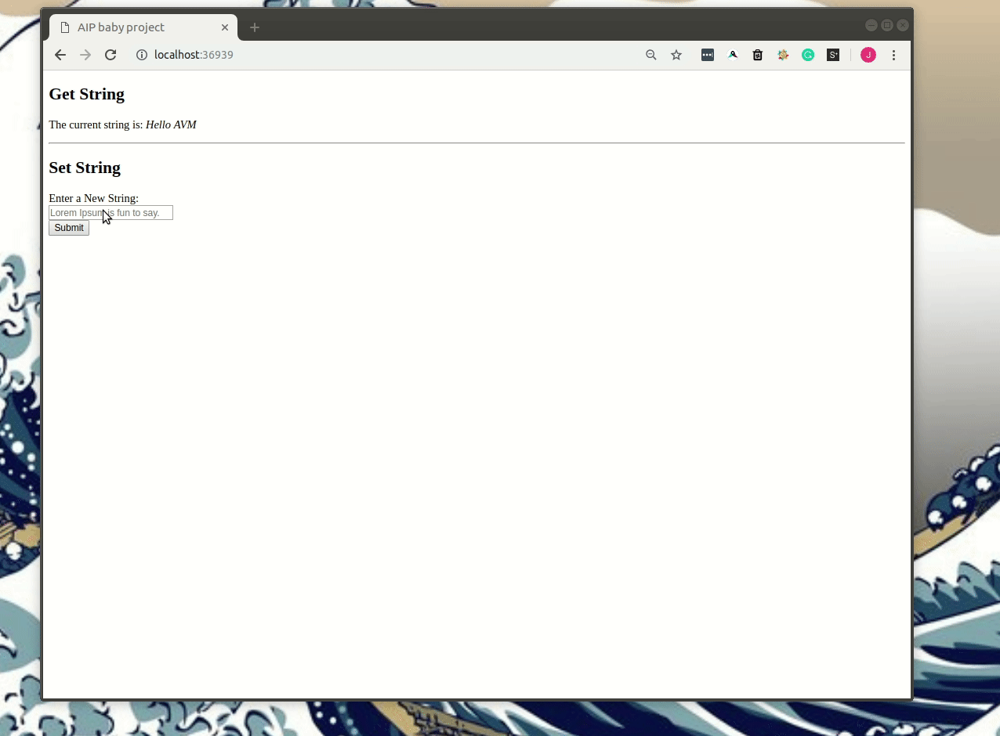

The contract used in `script.js` is deployed on Aion Mastery.

# Prerequisites
1. [Aiwa Wallet](https://learn.aion.network/docs/aiwa)
2. [Aion Faucet](https://learn.aion.network/docs/faucet-get-your-testnet-aion-coins)
3. [Aion Node](https://learn.aion.network/docs/nodesmith)

# Build

We will need a mini-server to host our application. 

Install `Serve` if you don't have it already

```shell
npm install -g serve
```

Then we can run our application:
```sh
cd src
serve
```

Go to the url that hosts your application!